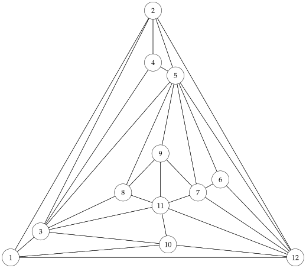
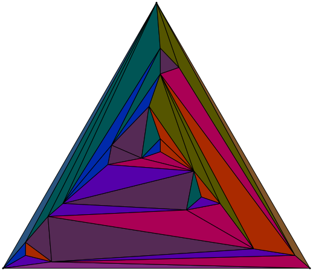

# PlanarMaps

*PlanarMaps.jl* is package for doing basic operations with planar maps (e.g., computing faces, inserting edges, etc.), drawing straight-line grid embeddings of them using [Schnyder's algorithm](https://cs.brown.edu/~rt/gdhandbook/chapters/straightline.pdf), and generating random planar maps. 

```julia
P = PlanarMap([
    [2,12,10,3],
    [12,1,3,4,5],
    [10, 11, 8, 5, 4, 2, 1],
    [5,2,3],
    [6,12,2,4,3,8,9,7],
    [12,5,7],
    [12,6,5,9,11],
    [9,5,3,11],
    [7,5,8,11],
    [1,12,11,3],
    [12,7,9,8,3,10],
    [10,1,2,5,6,7,11]])
draw(P)
```


```julia
draw(UWT(20),fillfaces=true,linecolor="black")
```
